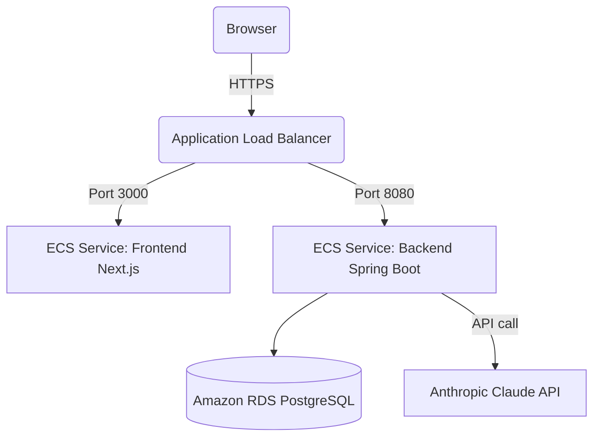

# GMB AI Manager

GMB AI Manager is a production-ready SaaS application designed to help local businesses manage and grow their Google Business Profile using Anthropic's Claude AI.

---

## Technical Stack
* **Frontend:** Next.js 15, TypeScript, Tailwind CSS v4, Axios, Recharts, Lucide Icons
* **Backend:** Spring Boot 3.4.0, Java 21, Spring Security (Google OAuth2 + JWT)
* **Database:** PostgreSQL 16
* **AI Engine:** Anthropic Claude Messages API (`claude-3-5-sonnet-20241022`)
* **Local Environment:** Docker Compose

---

## Local Development Prerequisites
To launch the GMB AI Manager locally, ensure you have installed:
1. **Node.js:** v18.17.0 or higher (with npm)
2. **Java Development Kit (JDK):** Version 21 (e.g. Temurin, Corretto)
3. **Docker Desktop:** Installed and running (for PostgreSQL container)
4. **Maven:** (Optional, as you can run directly via your IDE, or maven wrapper)

---

## Step-by-Step Local Run Guide

Follow these steps to run the application locally for the first time:

### Step 1: Start the PostgreSQL Database
We run PostgreSQL via Docker Compose to avoid manual DB installs.
From the project root directory, run:
```bash
docker-compose up -d
```
*This starts a PostgreSQL container listening on `localhost:5432` with database name `gmb_db` and password `postgrespassword`.*

### Step 2: Configure Environment Variables
Copy the template `.env.template` file to `.env` in your root or load them into your shell:
```bash
# In Windows PowerShell:
cp .env.template .env
```
Ensure `GOOGLE_API_MODE=SANDBOX` is set. This allows you to log in and sync mock Italian Restaurant locations ("Taste of Italy") immediately without needing a verified Google Developer API console project!

### Step 3: Run the Spring Boot Backend
Navigate to the `/backend` folder and compile/run the server:
```bash
cd backend
# If you have Maven installed globally:
mvn spring-boot:run
# Or compile and package:
mvn clean install
java -jar target/manager-0.0.1-SNAPSHOT.jar
```
*The backend API will start on `http://localhost:8080`.*

### Step 4: Run the Next.js Frontend
Navigate to the `/frontend` folder, install standard dependencies, and start the development server:
```bash
cd frontend
npm run dev
```
*The frontend web app will start on `http://localhost:3000`.*

---

## Evaluation & Testing Guide (Sandbox Mode)
1. Open your browser and navigate to `http://localhost:3000`.
2. Click the **"Continue with Google"** button on the Login page. 
   *(In Sandbox mode, the backend intercepts this and registers a mock client profile immediately, bypassing real Google OAuth forms).*
3. You will be redirected to the **SaaS Dashboard** showing visual area/bar charts with mock restaurant statistics (Calls, Clicks, Directions, and views).
4. Use the top bar switcher to toggle between different restaurant branches: **"Taste of Italy - Downtown"** and **"Taste of Italy - Westside"**.
5. Navigate to **Reviews** in the sidebar. Select a tone (e.g., *Friendly*, *Luxury*, *Healthcare*, or *Restaurant*) and click **"Generate AI Reply"**. You can modify the generated Claude draft inline and click **"Publish to Google"**.
6. Navigate to **Posts Builder** to generate Weekly or Promotional posts using AI, edit them, and save draft logs.
7. Navigate to **AI Weekly Reports** and click **"Generate New Audit"** to compile review sentiments, SEO guidelines, and opportunity reports.
8. Navigate to **Competitors** and type in competitor business names to track rating levels and categories.
9. Navigate to **Settings** to simulate downgrading/upgrading plans using Stripe checkout redirect placeholders.

---

## Production Deployment Guide (AWS ECS)

To deploy the application to production on Amazon Web Services (AWS) using ECS (Elastic Container Service) and Fargate, follow these standard practices:

### Infrastructure Architecture


### Steps to Deploy

#### 1. Database Provisioning
* Deploy an **Amazon RDS PostgreSQL** instance within your private VPC subnet.
* Update security groups to allow traffic on port `5432` only from the ECS Backend Security Group.

#### 2. Containerization
Build and tag production Docker images for both backend and frontend.

##### Backend Dockerfile (`/backend/Dockerfile`):
```dockerfile
FROM eclipse-temurin:21-jre-alpine
VOLUME /tmp
COPY target/*.jar app.jar
ENTRYPOINT ["java","-jar","/app.jar"]
```

##### Frontend Dockerfile (`/frontend/Dockerfile`):
```dockerfile
FROM node:20-alpine AS builder
WORKDIR /app
COPY package*.json ./
RUN npm ci
COPY . .
RUN npm run build

FROM node:20-alpine AS runner
WORKDIR /app
COPY --from=builder /app/.next ./.next
COPY --from=builder /app/node_modules ./node_modules
COPY --from=builder /app/package.json ./package.json
COPY --from=builder /app/public ./public
ENV NODE_ENV=production
EXPOSE 3000
CMD ["npm", "start"]
```

#### 3. Push to AWS ECR (Elastic Container Registry)
Create ECR repositories and push the container images:
```bash
# Log in to ECR
aws ecr get-login-password --region us-east-1 | docker login --username AWS --password-stdin <YOUR_AWS_ACCOUNT_ID>.dkr.ecr.us-east-1.amazonaws.com

# Tag and push
docker build -t gmb-backend ./backend
docker tag gmb-backend:latest <YOUR_AWS_ACCOUNT_ID>.dkr.ecr.us-east-1.amazonaws.com/gmb-backend:latest
docker push <YOUR_AWS_ACCOUNT_ID>.dkr.ecr.us-east-1.amazonaws.com/gmb-backend:latest
```

#### 4. Configure ECS Task Definitions
Create Task Definitions for both services in the AWS Console or using AWS CDK:
* **Backend Env Variables:**
  * `DATABASE_URL`: `jdbc:postgresql://<rds-endpoint>:5432/gmb_db`
  * `DATABASE_USERNAME`, `DATABASE_PASSWORD`: Credential parameters from **AWS Secrets Manager**.
  * `JWT_SECRET`: Secure string from Secrets Manager.
  * `ANTHROPIC_API_KEY`: Secrets Manager value.
  * `GOOGLE_API_MODE`: `PRODUCTION`
  * `GOOGLE_CLIENT_ID`, `GOOGLE_CLIENT_SECRET`: Real OAuth credentials from Google Cloud Console.
* **Frontend Env Variables:**
  * `NEXT_PUBLIC_API_URL`: Backend Load Balancer HTTPS URL.

#### 5. Set up ALB (Application Load Balancer) & Fargate Services
* Deploy an ALB with SSL certificate validation (ACM).
* Routing rules:
  * `/api/*` and `/oauth2/*` route to backend target group (Port 8080).
  * `/*` (default) routes to frontend target group (Port 3000).
* Create ECS Service on **AWS Fargate** with target groups connected to the ALB rules.
